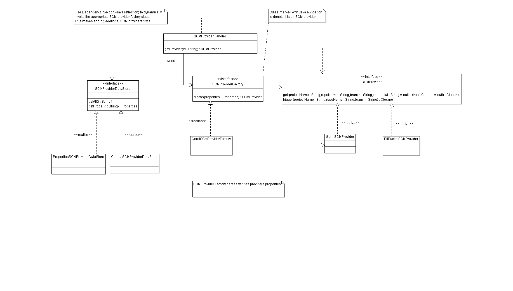

# Accenture DevOps Platform Pluggable SCM Library

This library provides a mechanism to enable multiple SCM support (Gerrit, BitBucket) for ADOP cartridges.

## Library Class Diagram



## Extending the SCM Library

### Adding an addtional SCM provider

To add an additional SCMProvider the following is required;
 - Create classes that implement the SCMProvider and SCMHandlerFactory interface according to your SCM provider in the pluggable.scm.<SCM-provider-type> package.
 - Add an annotation (@SCPProviderInfo) to the new SCMProvider concrete class to mark the class as an SCM provider and provide a human friendly type name.
 
## Testing

To execute the utilities tests execute.

```gradlew test```
